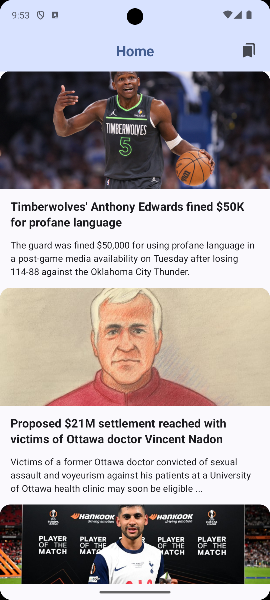
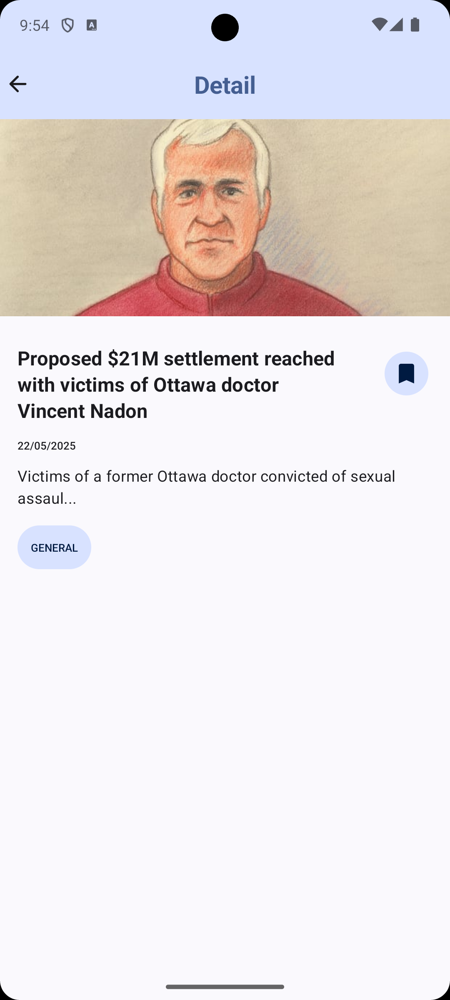

## News Application - Jetpack Compose Clean Architecture Example

News app is a sample project that displays news using the News API, built with Jetpack Compose.It demonstrates the current UI capabilities of Compose and follows the Clean Architecture and MVVM design patterns


<table>
  <tr>
    <td>
      
    </td>
    <td>
      
    </td>
    <td>
      
    </td>
  </tr>
</table>

## Features

The example shows current news from thenewsapi and other information such as:
   * Newsfeeds
   * Bookmark article
   * View article detail


## Data-Flow


## Tech Stack & Architecture

* **Core:**
    * [Kotlin](https://kotlinlang.org/): Primary programming language.
    * [Coroutines](https://kotlinlang.org/docs/coroutines-overview.html): For asynchronous programming and managing background tasks.
    * [Kotlin Flows](https://kotlinlang.org/docs/flow.html): Used extensively for reactive data streams, particularly with Room and network responses.

* **Architecture:**
    * Clean Architecture
    * MVVM (Model-View-ViewModel)

* **Dependency Injection:**
    * [Hilt](https://dagger.dev/hilt/): For managing dependencies throughout the application, simplifying DI in Android.

* **User Interface (UI):**
    * [Jetpack Compose](https://developer.android.com/jetpack/compose): For building the native UI declaratively with Kotlin.
    * [Material 3](https://m3.material.io/): Implementing Material Design components and theming.
    * [Compose Navigation](https://developer.android.com/jetpack/compose/navigation): For handling navigation between screens in a Compose-first way.
    * [ViewModel](https://developer.android.com/topic/libraries/architecture/viewmodel): Part of Jetpack, used to store and manage UI-related data in a lifecycle-conscious way.
    * [Coil](https://coil-kt.github.io/coil/compose/): For image loading in Jetpack Compose, optimized for Kotlin and Coroutines.

* **Networking:**
    * [Retrofit](https://square.github.io/retrofit/): For type-safe HTTP client and consuming RESTful APIs.
    * [OkHttp](https://square.github.io/okhttp/): As the underlying HTTP client for Retrofit, providing interceptors for logging and request modification.
    * [Gson](https://github.com/google/gson): For JSON serialization and deserialization.

* **Data & Storage:**
    * [Room](https://developer.android.com/training/data-storage/room): For local database persistence (likely for bookmarks or caching).
    * [Paging 3](https://developer.android.com/topic/libraries/architecture/paging/v3-overview): For efficiently loading and displaying large datasets in lists (e.g., news articles).

* **Testing:**
    * [JUnit 5](https://junit.org/junit5/): For unit testing.
    * [MockK](https://mockk.io/): For creating mocks in Kotlin unit tests.
    * [Turbine](https://github.com/cashapp/turbine): For testing Kotlin Flows.

## How to Run This Project

Follow these steps to get the NewsApplication project up and running on your local machine.

### Prerequisites

* **Android Studio**: Make sure you have the latest stable version of [Android Studio](https://developer.android.com/studio) installed.
* **JDK**: JDK 17 or higher is recommended (usually bundled with recent Android Studio versions).
* **Git**: For cloning the repository.

### Setup Steps

1.  **Clone the Repository:**
    Open your terminal or command prompt and run the following command:
    ```bash
    git clone [https://github.com/hoangphuc612/NewsApplication.git](https://github.com/hoangphuc612/NewsApplication.git)
    ```
    Then, navigate into the cloned directory:
    ```bash
    cd NewsApplication
    ```

2.  **Open in Android Studio:**
    * Launch Android Studio.
    * Select "Open" (or "Open an Existing Project").
    * Navigate to the `NewsApplication` directory that you cloned and select it.
    * Android Studio will import the project and sync Gradle. This might take a few minutes.

### Build and Run

1.  **Wait for Gradle Sync:** Ensure Gradle sync finishes successfully.
2.  **Select a Device/Emulator:**
    * Connect an Android device via USB (with USB debugging enabled).
    * Or, create and start an Android Virtual Device (AVD) from the AVD Manager in Android Studio.
3.  **Run the App:**
    * Click the **Run 'app'** button (the green play icon ▶️) in the Android Studio toolbar.
    * Or, select `Run > Run 'app'` from the menu.

Android Studio will build the project and install the app on your selected device or emulator.


# Running Tests
  Open terminal and run the following command:
  ```bash
  ./gradlew testDebugUnitTest
  ```
